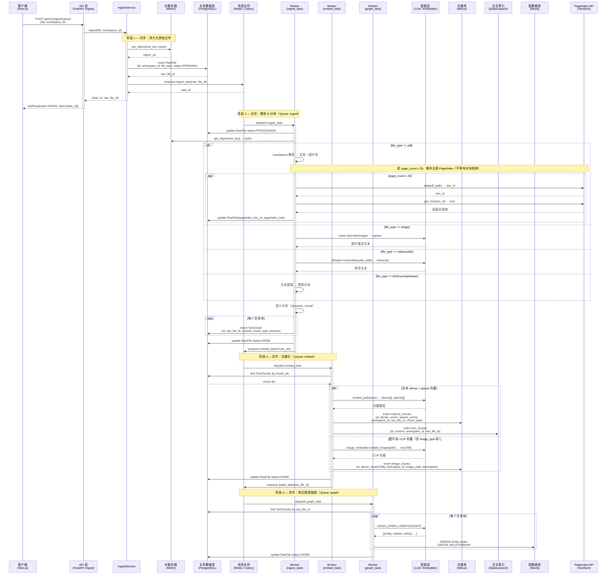

# 流程 1：文件导入流水线（Ingestion Pipeline）

用户上传文件（PDF / 图片 / 视频 / 音频 / HTML / CSV / Markdown）。系统同步写入元数据后立即返回任务 ID；后台异步完成解析 → 分块 → 向量化 → 知识图谱抽取。对于 ≥20 页的 PDF，向量化 / 图谱流水线正常执行，同时额外向 PageIndex 提交建树（两件事并行，互不干扰）。

## 步骤说明

| # | 发起方 → 接收方 | 说明 |
|---|---|---|
| 1 | 客户端 → API | 用户通过前端表单上传文件，携带目标工作区 ID。请求为 `multipart/form-data`。 |
| 2 | API → IngestService | API 层鉴权（JWT + RBAC）通过后，将文件字节流和元信息交给 `IngestService.ingest()`。 |
| 3 | IngestService → MinIO | 将原始文件字节流写入 MinIO 对象存储，key 格式为 `raw/{workspace_id}/{uuid}.{ext}`，永久保留原始文件以备重新处理。 |
| 4 | IngestService → PostgreSQL | 在 `t_raw_files` 表插入一条记录，初始状态为 `PENDING`，记录文件类型、存储路径、工作区归属。 |
| 5 | IngestService → Redis | 将 `ingest_task(raw_file_id)` 压入 Celery `ingest` 队列，获得任务 ID。 |
| 6 | API → 客户端 | 同步阶段结束，立即返回 `{task_id, raw_file_id}`；客户端可用 task_id 轮询进度，无需等待耗时的解析过程。 |
| 7 | Redis → ingest_task Worker | Celery Worker 从 `ingest` 队列取出任务，进入异步解析阶段。 |
| 8 | Worker → PostgreSQL | 将文件状态更新为 `PROCESSING`，防止重复消费。 |
| 9 | Worker → MinIO | 从对象存储取回原始文件字节，准备解析。 |
| 10 | Worker（分支解析） | 根据文件类型选择解析策略：**PDF** 用 markitdown 提取文本与图片页；**图片** 调用 LLM Vision 生成描述文本（caption）；**视频 / 音频** 调用 Whisper 转写为文本；**HTML / CSV / Markdown** 用规则提取器直接解析。 |
| 11 | Worker → PageIndex API（仅 ≥20 页 PDF） | 对大型 PDF 额外调用 `_register_pageindex()`：将 PDF 上传至 PageIndex API，获取 `doc_id` 和层级目录树，写入 `t_raw_files.pageindex_doc_id / pageindex_tree`。此步骤与分块流水线并列，不替代分块。 |
| 12 | Worker → Worker（分块） | 统一用 `semantic_chunk()` 对提取文本进行语义分块，保留重叠窗口以防上下文截断。 |
| 13 | Worker → PostgreSQL（循环） | 将每个 `TextChunk` 写入 `t_text_chunks`，记录所属文件、块类型（text / image）、块序号和内容。 |
| 14 | Worker → Redis | 将 `embed_task(chunk_ids)` 压入 `embed` 队列，触发下一阶段。 |
| 15 | Redis → embed_task Worker | Celery Worker 从 `embed` 队列取出任务，进入向量化阶段。 |
| 16 | EmbedWorker → PostgreSQL | 批量读取指定 chunk_ids 的 `TextChunk`，准备批量向量化。 |
| 17 | EmbedWorker → LLM（文本向量，并行） | 调用 `rt.embedder.embed_both(texts)` 同时生成 dense 向量（text-embedding-3-small, dim=1536）和 sparse 向量（BM42）。 |
| 18 | EmbedWorker → Milvus（文本） | 将文本块的 dense + sparse 向量批量写入 `match3_chunks` 集合，携带 workspace_id 用于隔离过滤。 |
| 19 | EmbedWorker → Elasticsearch（文本） | 同步将文本内容写入 ES `text_chunks` 索引，支持 BM25 关键词检索，与向量检索形成互补。 |
| 20 | EmbedWorker → LLM（图片向量，并行） | 对 `chunk_type=image` 的块，调用 `rt.image_embedder.embed_image(path)` 获取 CLIP 向量（dim=768），支持图文跨模态检索。 |
| 21 | EmbedWorker → Milvus（图片） | 将 CLIP 向量写入 `image_chunks` 集合，携带图片路径和描述文本，供图文混合查询使用。 |
| 22 | EmbedWorker → Redis | 将 `graph_task(raw_file_id)` 压入 `graph` 队列。 |
| 23 | Redis → graph_task Worker | Celery Worker 从 `graph` 队列取出任务，进入知识图谱抽取阶段。 |
| 24 | GraphWorker → LLM（循环） | 对每个文本块，调用 LLM 抽取实体和关系三元组 `(entity, relation, entity)`，使用结构化 JSON 输出格式以保证可解析性。 |
| 25 | GraphWorker → Neo4j | 对抽取到的实体用 `MERGE` 去重写入（避免重复节点），用 `CREATE RELATIONSHIP` 写入关系边，支持后续图谱 RAG 查询。 |
| 26 | GraphWorker → PostgreSQL | 将文件状态更新为 `DONE`，整条导入流水线结束。 |
