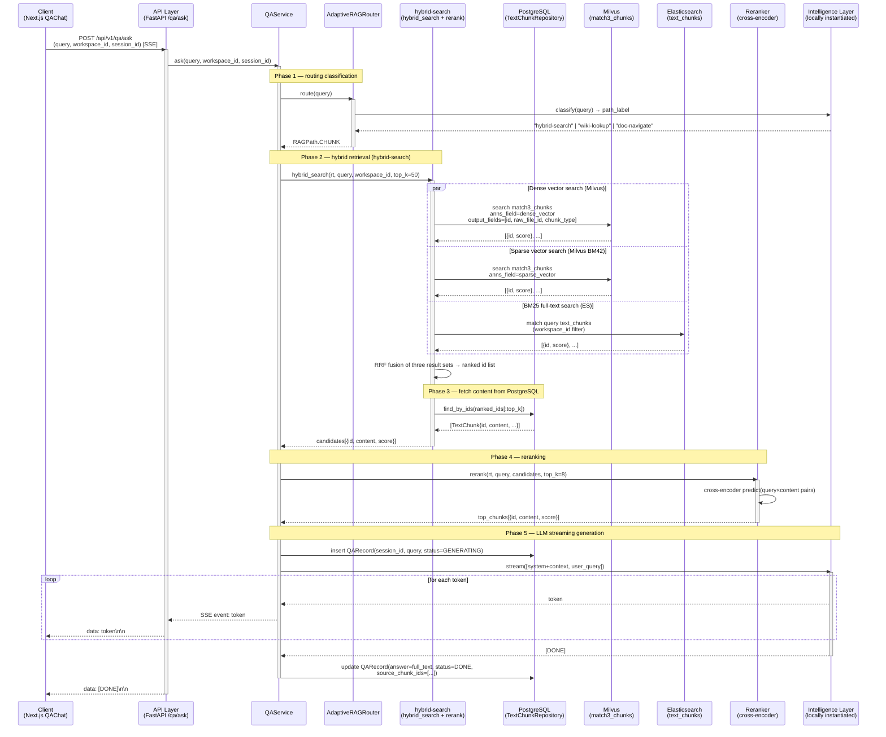

# 流程 2：Q&A 问答（hybrid-search 检索路径）

用户提问 → AdaptiveRAGRouter 路由到 hybrid-search → 混合检索 → 重排序 → LLM 生成 → SSE 流式返回。

Q&A 服务有三条检索路径：
- **hybrid-search**（本流程）：混合检索（Dense + Sparse + BM25 + 可选 GraphRAG）+ 重排序，适用于大多数通用问题
- **wiki-lookup**：直接读取已编译的 Wiki 页面，适用于已有现成 Wiki 条目的主题查询（见[流程 3](flow-3-wiki-compile.md)）
- **doc-navigate**：PageIndex 目录树导航，适用于指向特定大型 PDF 文档的查询（见[流程 4](flow-4-pageindex.md)）

## 步骤说明

| # | 发起方 → 接收方 | 说明 |
|---|---|---|
| 1 | 客户端 → API | 前端以 SSE 长连接方式发起 GET 请求，携带用户问题、工作区 ID、会话 ID。使用 GET + SSE 而非 POST 是为了让浏览器 `EventSource` 原生支持。 |
| 2 | API → QAService | API 层鉴权后将请求转交 `QAService.ask()`，该方法返回一个异步生成器供 `StreamingResponse` 消费。 |
| 3 | QAService → AdaptiveRAGRouter | 路由器接收原始问题，判断应走哪条检索路径。此处结果为 `RAGPath.CHUNK`（hybrid-search，本流程）；若路由到 `ENTRY` 则走 wiki-lookup；若路由到 `PAGE` 则走 doc-navigate 长文档目录树导航。 |
| 4 | Router → LLM | 路由器调用本地实例化的 LLM 以少样本 prompt 对问题分类，返回路径标签字符串（`hybrid-search` / `wiki-lookup` / `doc-navigate`）。分类 prompt 包含三条路径的特征描述和示例，保证分类准确。 |
| 5 | QAService → hybrid_search（并行三路） | 同时发起三路检索：**Dense 向量检索**（语义相似度，召回语义近似但措辞不同的块）、**Sparse 向量检索 BM42**（关键词权重，召回高频术语匹配块）、**ES BM25 全文检索**（经典关键词倒排，召回精确词汇命中块）。三路并行以降低总延迟。 |
| 6 | RAG → Milvus（Dense） | 对查询文本生成 dense 向量后，在 `match3_chunks` 集合的 `dense_vector` 字段做 ANN 近邻搜索，按 workspace_id 过滤，返回 top-N 候选 ID 和余弦相似度分。 |
| 7 | RAG → Milvus（Sparse） | 对查询文本生成 BM42 稀疏向量后，在同一集合的 `sparse_vector` 字段做稀疏向量检索，返回 top-N 候选 ID 和 BM42 分。 |
| 8 | RAG → Elasticsearch | 在 `text_chunks` 索引执行 BM25 match 查询，同样按 workspace_id 过滤，返回 top-N 文档 ID 和 BM25 相关性分。 |
| 9 | RAG → RAG（RRF 融合） | 对三路结果用 **Reciprocal Rank Fusion** 算法合并排序：`score = Σ 1/(k + rank_i)`，k=60。RRF 对各路分数的量纲无要求，对任意单路召回失效具有鲁棒性。取融合后 top-50 ID。 |
| 10 | RAG → PostgreSQL | 向量库只存储 ID 和向量，不存文本内容；用 RRF 得到的 ID 列表批量查询 PostgreSQL 的 `t_text_chunks` 表，取回完整 `content` 字段。 |
| 11 | RAG → QAService | 返回 50 个带内容的候选块，供重排序使用。 |
| 12 | QAService → Reranker | 调用 `rerank()`，将查询与每个候选块组成 (query, passage) 对，批量送入 cross-encoder（`ms-marco-MiniLM-L-6-v2`）精算语义相关度，取 top-8。Cross-encoder 精度远高于 bi-encoder，但计算量大，故只对 50 个候选做精排而非全量。 |
| 13 | QAService → PostgreSQL（写入） | 在 `t_qa_sessions` 插入一条记录，初始状态 `GENERATING`，记录本次问答的 session_id 和原始问题，为后续用量统计和历史查询提供数据。 |
| 14 | QAService → LLM（流式） | 将 top-8 文本块拼接为 context，构造 system prompt（角色 + 引用格式要求）和 user message（问题），调用本地实例化的 LLM 获取流式 token 生成器。 |
| 15 | LLM → 客户端（token 循环） | 每产生一个 token，依次经 QAService → API → 客户端推送，格式为标准 SSE `data: <token>\n\n`。客户端用 `EventSource` 监听并实时拼接显示，实现打字机效果。 |
| 16 | QAService → PostgreSQL（更新） | 流式生成结束后，将完整 answer 文本、来源块 ID 列表和最终状态 `DONE` 写回 `t_qa_sessions`，支持历史回顾和来源溯源。 |
| 17 | API → 客户端（结束信号） | 推送 `data: [DONE]\n\n`，客户端据此关闭 SSE 连接，更新 UI 状态（停止 loading 动画，显示来源引用）。 |
