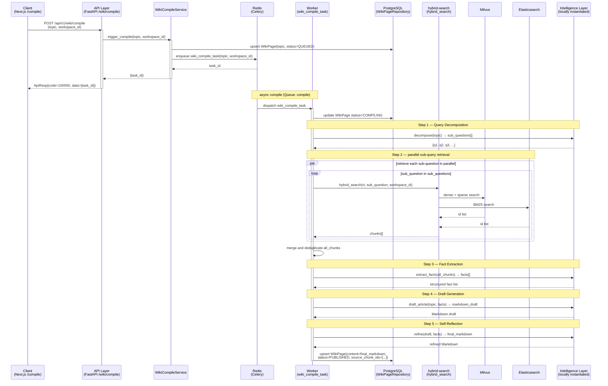

# 流程 3：Wiki 页面编译（wiki-lookup）

触发对某个 Wiki 主题的编译 → OpenKB 五步流水线 → 写入 Wiki 页面。

编译完成后，用户查询该主题时路由器返回 `RAGPath.ENTRY`，QAService 直接读取已编译的页面返回答案，不再走向量检索，速度极快。

## 步骤说明

| # | 发起方 → 接收方 | 说明 |
|---|---|---|
| 1 | 客户端 → API | 用户在 Wiki 管理界面选择主题并点击"编译"，前端发送 POST 请求，携带 `topic`（主题名称）和 `workspace_id`。 |
| 2 | API → WikiCompileService | API 层鉴权后调用 `WikiCompileService.trigger_compile()`，进入同步阶段。 |
| 3 | WikiCompileService → PostgreSQL | 用 `upsert` 写入或更新 `t_wiki_pages` 记录，状态设为 `QUEUED`。若该主题已有页面，则覆盖（支持重新编译）；若为新主题，则新建。 |
| 4 | WikiCompileService → Redis | 将 `wiki_compile_task(topic, workspace_id)` 压入 Celery `compile` 队列，获得任务 ID。 |
| 5 | API → 客户端 | 同步阶段立即返回 `{task_id}`；前端可用 task_id 轮询编译进度（`QUEUED → COMPILING → PUBLISHED / FAILED`）。 |
| 6 | Redis → wiki_compile_task Worker | Celery Worker 从 `compile` 队列取出任务，进入五步编译流水线。 |
| 7 | Worker → PostgreSQL | 将页面状态更新为 `COMPILING`，前端轮询时可感知编译已开始。 |
| 8 | Worker → LLM（步骤 1：问题分解） | 调用本地实例化的 LLM 对主题执行查询分解（Query Decomposition）：将一个宽泛主题（如"三消游戏留存策略"）拆解为若干具体子问题（"三消游戏的 Day-1 留存影响因素有哪些？"、"难度曲线如何影响玩家留存？"等）。子问题数量通常 5–10 个，覆盖主题的不同维度。 |
| 9 | Worker → RAG（步骤 2：并行检索） | 对每个子问题独立调用 `hybrid_search()`，三路混合检索（Dense + Sparse + BM25）后 RRF 融合。多个子问题的检索任务通过 `asyncio.gather` 或线程池并发执行以节省时间。 |
| 10 | RAG → Milvus + ES | 每个子问题的检索过程与流程 2 的阶段 2 完全相同：dense 向量、sparse 向量、BM25 三路并发，RRF 融合后返回 top-N 块。 |
| 11 | Worker → Worker（合并去重） | 汇总所有子问题的检索结果，按 chunk_id 去重，得到覆盖主题各维度的 `all_chunks` 集合，通常包含数十到上百个文本块。 |
| 12 | Worker → LLM（步骤 3：事实提取） | 将 `all_chunks` 文本连同结构化 prompt 一起发给 LLM，要求以 JSON 格式输出事实条目列表（每条含 `fact`、`source_chunk_id`、`confidence`）。事实提取将原始检索内容转化为结构化知识，为后续草稿生成提供有序输入，并过滤掉噪声和矛盾内容。 |
| 13 | Worker → LLM（步骤 4：草稿生成） | 将主题名称和步骤 3 提取的事实列表发给 LLM，要求生成一篇结构化 Markdown 文章（含标题、小节、要点）。此步骤聚焦于内容组织和结构化表达，不要求自我修正。 |
| 14 | Worker → LLM（步骤 5：自我反思润色） | 将草稿和事实列表一起发给 LLM，要求对照事实检验草稿的准确性、完整性和表达质量，输出最终精修版 Markdown。自我反思（Self-Reflection）是 OpenKB 五步法的核心，显著降低幻觉率。 |
| 15 | Worker → PostgreSQL | 将最终 Markdown 内容、来源块 ID 列表用 `upsert` 写回 `t_wiki_pages`，状态更新为 `PUBLISHED`，并记录 `compiled_at` 时间戳。前端轮询到 `PUBLISHED` 后展示编译完成的 Wiki 页面。 |
