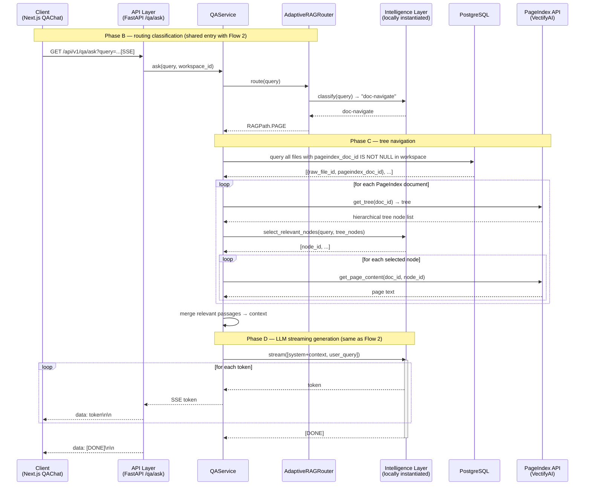

# 流程 4：doc-navigate 检索路径（PageIndex 目录树导航）

doc-navigate 是 Q&A 服务的三条检索路径之一，专门用于处理"请在这份报告的第 X 章里找到关于 Y 的内容"类查询。它通过 PageIndex 的层级目录树精准定位大型 PDF 文档中的相关章节，而不是对全文做向量检索。

> **导入侧**：大型 PDF 在导入时已经走完完整的分块 → embed（Milvus/ES）→ graph（Neo4j）流水线，**同时**向 PageIndex 提交建树（见[流程 1](flow-1-ingestion.md)）。因此 doc-navigate 路径在查询时直接使用已构建好的目录树，不需要额外的导入步骤。

## 步骤说明

| # | 发起方 → 接收方 | 说明 |
|---|---|---|
| 1 | 客户端 → API | 用户提问，与普通 Q&A 入口相同，前端无需感知底层检索路径。 |
| 2 | QAService → AdaptiveRAGRouter | 路由器对问题分类。当问题涉及"某本报告"、"第几章"、"文档中"等指向特定长文档的语义特征时，LLM 分类器返回 `doc-navigate`。 |
| 3 | QAService → PostgreSQL | 查询当前工作区内所有 `pageindex_doc_id IS NOT NULL` 的文件，获取其 `doc_id` 列表。 |
| 4 | QAService → PageIndex（get_tree） | 对每个 PageIndex 文档调用 `get_tree(doc_id)`，获取完整的层级目录树节点列表（含节点 ID、标题、层级、页码范围）。目录树通常仅有数十至数百个节点，传输体积远小于全文。 |
| 5 | QAService → LLM（节点选择） | 将用户查询和目录树节点列表构造为 prompt，让 LLM 判断哪些节点与查询最相关，返回 `node_id` 列表。LLM 作为"智能目录导航器"，精准定位相关章节。 |
| 6 | QAService → PageIndex（get_page_content，循环） | 对 LLM 选中的每个节点调用 `get_page_content(doc_id, node_id)`，逐一取回对应页面的完整文本内容。 |
| 7 | QAService → QAService（合并） | 将各节点的页面文本按文档顺序合并为统一的 `context` 字符串，作为 LLM 生成的上下文输入。 |
| 8 | QAService → LLM（流式） | 与流程 2 的阶段 5 相同：将 context 和用户问题构造 prompt，调用本地实例化的 LLM 获取流式 token。 |
| 9 | LLM → 客户端（token 循环） | 每个 token 依次经 QAService → API → 客户端推送，格式为标准 SSE `data: <token>\n\n`。 |
| 10 | API → 客户端（结束信号） | 推送 `data: [DONE]\n\n`，前端关闭 SSE 连接，完成本次问答。 |
